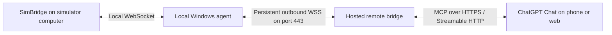

# Proposal: remote MCP bridge for mobile ChatGPT

Status: future proposal, not implemented or scheduled.

## Motivation

Keep the current local MCP approach while documenting a possible evolution that
lets a user run MSFS on a Windows computer and talk to a copilot through ordinary
ChatGPT Chat on a phone, without requiring a local Work or Codex conversation.

The user found the phone's Chat experience more natural and apparently more
responsive than the Work conversation used during development. This is a
subjective observation, not a measured performance difference. Voice settings,
models, tool execution, and product configuration may explain part of it.
The goal is to evaluate that experience before committing to a hosted platform.

## Current approach remains the baseline

- A local .NET executable exposes MCP tools over stdio.
- Mock mode provides a fixed fictional aircraft scenario.
- Real mode supports an initial read-only left MCDU screen integration through
  SimBridge; live simulator validation is still pending.
- General aircraft telemetry through SimConnect is not implemented.

This proposal does not change configuration, deployment, release behavior, or
the existing local tools. A remote relay would transport available data, not
create access to instruments that the local adapters cannot read.

## Proposed architecture

The local agent initiates the outbound connection. No inbound router port or
public SimBridge endpoint is required. Network policies may still restrict
WebSocket access.

MCP is the interface between ChatGPT and the remote bridge. The agent-to-bridge
connection can use a small application protocol over secure WebSocket rather
than a second MCP implementation.

An Azure-hosted ASP.NET Core service is one possible deployment. The hosting
choice is not final; it must support persistent WebSockets, HTTPS, connection
lifecycle management, and the selected MCP transport.

## Intended user journey

1. Start the local executable on the simulator computer.
2. The executable connects to the remote bridge and starts device pairing.
3. The user authorizes the device and receives setup instructions.
4. Add the remote MCP server as a custom plugin in ChatGPT, where supported,
   and authorize access to the paired device.
5. On a phone, select the installed plugin and ask for aircraft information
   while speaking naturally with the copilot.
6. Stop or revoke access from the local agent or account.

Pasting an MCP URL into a conversation is not the registration mechanism.
The custom server must first be added and installed through the supported
ChatGPT integration flow.

Mobile use, custom plugin availability, voice access to the tools, and account
or workspace restrictions must be tested explicitly. A web setup flow does not
by itself establish that the desired mobile voice experience is supported.

## Connection and data flow

Use persistent WSS for the first prototype. It provides reliable, ordered
messages over TCP and avoids introducing a custom TCP/UDP service. UDP is not
justified for the initial screen/state queries. No latency target is promised
until measurements exist.

The protocol should cover:

- Device authentication and connection establishment.
- Heartbeats, disconnect detection, and bounded reconnect backoff.
- State updates with sequence numbers and timestamps.
- On-demand reads with request IDs, deadlines, and correlated responses.
- Explicit offline, expired-data, and source-error responses.

The agent may publish updates when data changes. The remote bridge can retain
the latest snapshot briefly so MCP reads do not always require a round trip to
the local computer. Each response must identify its source, capture/receipt
times, and freshness. Define expiry per data type and invalidate data on
disconnect. An old snapshot must never be presented as current telemetry.

A long-lived relay connection does not guarantee continuous ChatGPT polling,
background monitoring, or unsolicited spoken callouts. Those behaviors require
separate product capability validation.

## Identity and isolation

Separate the device identifier, the local agent credential, and the user's
authorization to read a device.

The preferred shared-service design uses a stable MCP URL, OAuth for ChatGPT
user authorization, and a device-pairing flow. The relay maps the authorized
user to the correct device and enforces isolation on every request.

An example endpoint is `https://example.com/mcp`; it is illustrative, not a
deployed service. A per-session path could identify a session, but the session
ID should not be the only authorization mechanism for a shared service.

A temporary, high-entropy, revocable capability URL could be considered for a
private prototype. Anyone possessing such a URL would have its access rights;
URLs may be retained in conversation history or logs. It is not the preferred
authentication design for distribution.

Do not assume ChatGPT can send an arbitrary custom API-key header. Follow the
authentication mechanisms supported by the selected integration surface.
Store agent credentials locally, allow rotation and revocation, and avoid
logging secrets or retaining screen contents by default.

## Initial scope

Start with read-only device status and left MCDU screen reads. Preserve explicit
Mock/Real source labeling and existing error semantics. Do not add key presses
or cockpit writes as part of the relay prototype.

Later, a SimConnect adapter could supply general aircraft telemetry independently
of SimBridge. The relay should preserve the distinction between screen content
and structured aircraft state.

## Suggested evaluation sequence

1. Validate the existing SimBridge reader on the simulator computer.
2. Verify custom remote MCP use in ordinary Chat and the intended phone/voice
   experience with the user's account before building the full relay.
3. Prototype one local agent, one relay instance, and read-only tools.
4. Test pairing, revocation, reconnects, offline behavior, deadlines, and stale
   snapshots. For multiple users, verify cross-device access is rejected.
5. Measure local acquisition time, relay delay, MCP call duration, and perceived
   spoken-response time separately. Compare Chat and Work under similar settings.
6. Choose hosting, persistence, scaling, and operational costs from those results.

For multiple relay instances, connection routing and shared session state need
an explicit design; an in-memory device map on one server is only a prototype.

## Open decisions

- Availability of custom MCP tools in the intended mobile Chat/voice experience.
- Stable user accounts versus an initial private pairing flow.
- Snapshot expiry rules and update frequency for each data type.
- Azure service, region, idle behavior, and WebSocket connection limits.
- Whether a supported secure tunnel can satisfy the personal-use case with
  less infrastructure than a custom relay.
- Whether the observed conversational difference remains after aligning voice
  and model settings.

## References

These describe integration options, not a guarantee of account or mobile
availability. Recheck the current documentation before implementation.

- [Add a custom MCP server to ChatGPT](https://developers.openai.com/api/docs/guides/custom-mcp-server)
- [MCP in ChatGPT and Codex](https://learn.chatgpt.com/docs/extend/mcp)
- [Plugin authentication](https://developers.openai.com/plugins/build/auth)
- [ChatGPT Voice](https://learn.chatgpt.com/docs/features/voice)
- [Current SimBridge integration](simbridge.md)

For flight simulation only; not intended for real aircraft operations.
